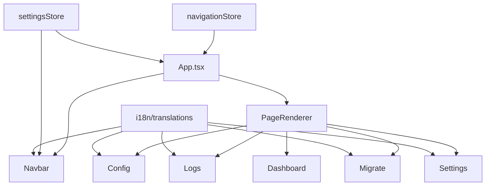
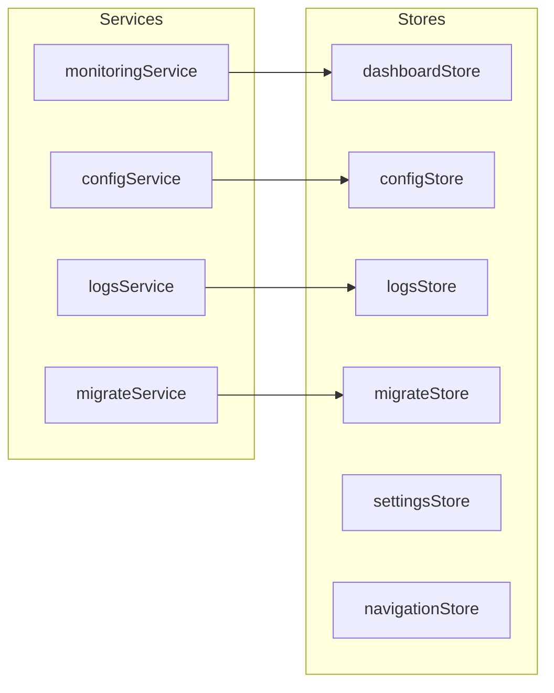

# Walkthrough: Config, Logs, Migrate, Settings Implementation

## Overview

Implemented four complete feature pages for PorterClaw (OpenClaw management tool), plus navigation infrastructure, theme switching (System/Light/Dark), and i18n (English/中文).

## Architecture

````carousel

<!-- slide -->

````

## Files Created/Modified

### New Files (23)

| Category | File | Purpose |
|----------|------|---------|
| Types | [config.ts](file:///Users/mrzhaoyi/Workspace/LLM/PorterClaw/src/common/types/config.ts) | OpenClaw config types |
| Types | [logs.ts](file:///Users/mrzhaoyi/Workspace/LLM/PorterClaw/src/common/types/logs.ts) | Log entry/filter types |
| Types | [migrate.ts](file:///Users/mrzhaoyi/Workspace/LLM/PorterClaw/src/common/types/migrate.ts) | Migration package types |
| Types | [settings.ts](file:///Users/mrzhaoyi/Workspace/LLM/PorterClaw/src/common/types/settings.ts) | App settings types |
| i18n | [translations.ts](file:///Users/mrzhaoyi/Workspace/LLM/PorterClaw/src/renderer/i18n/translations.ts) | EN/ZH translations |
| Stores | [navigationStore.ts](file:///Users/mrzhaoyi/Workspace/LLM/PorterClaw/src/renderer/stores/navigationStore.ts) | Page routing |
| Stores | [settingsStore.ts](file:///Users/mrzhaoyi/Workspace/LLM/PorterClaw/src/renderer/stores/settingsStore.ts) | Persistent settings |
| Stores | [configStore.ts](file:///Users/mrzhaoyi/Workspace/LLM/PorterClaw/src/renderer/stores/configStore.ts) | Config state |
| Stores | [logsStore.ts](file:///Users/mrzhaoyi/Workspace/LLM/PorterClaw/src/renderer/stores/logsStore.ts) | Logs with filtering |
| Stores | [migrateStore.ts](file:///Users/mrzhaoyi/Workspace/LLM/PorterClaw/src/renderer/stores/migrateStore.ts) | Migration state |
| Services | [configService.ts](file:///Users/mrzhaoyi/Workspace/LLM/PorterClaw/src/renderer/services/configService.ts) | OpenClaw CLI bridge |
| Services | [logsService.ts](file:///Users/mrzhaoyi/Workspace/LLM/PorterClaw/src/renderer/services/logsService.ts) | Log fetching/export |
| Services | [migrateService.ts](file:///Users/mrzhaoyi/Workspace/LLM/PorterClaw/src/renderer/services/migrateService.ts) | Pack/export/delete |
| Pages | [Config.tsx](file:///Users/mrzhaoyi/Workspace/LLM/PorterClaw/src/renderer/pages/Config.tsx) | Config page |
| Pages | [Logs.tsx](file:///Users/mrzhaoyi/Workspace/LLM/PorterClaw/src/renderer/pages/Logs.tsx) | Logs page |
| Pages | [Migrate.tsx](file:///Users/mrzhaoyi/Workspace/LLM/PorterClaw/src/renderer/pages/Migrate.tsx) | Migrate page |
| Pages | [Settings.tsx](file:///Users/mrzhaoyi/Workspace/LLM/PorterClaw/src/renderer/pages/Settings.tsx) | Settings page |
| Components | [InstallGuide.tsx](file:///Users/mrzhaoyi/Workspace/LLM/PorterClaw/src/renderer/components/config/InstallGuide.tsx) | 3-step install wizard |
| Components | [GatewayControl.tsx](file:///Users/mrzhaoyi/Workspace/LLM/PorterClaw/src/renderer/components/config/GatewayControl.tsx) | Gateway start/stop/restart |
| Components | [ConfigEditor.tsx](file:///Users/mrzhaoyi/Workspace/LLM/PorterClaw/src/renderer/components/config/ConfigEditor.tsx) | Config form editor |
| Components | [MigrateImport.tsx](file:///Users/mrzhaoyi/Workspace/LLM/PorterClaw/src/renderer/components/config/MigrateImport.tsx) | Import dropzone |
| Styles | [config.css](file:///Users/mrzhaoyi/Workspace/LLM/PorterClaw/src/renderer/styles/config.css), [logs.css](file:///Users/mrzhaoyi/Workspace/LLM/PorterClaw/src/renderer/styles/logs.css), [migrate.css](file:///Users/mrzhaoyi/Workspace/LLM/PorterClaw/src/renderer/styles/migrate.css), [settings.css](file:///Users/mrzhaoyi/Workspace/LLM/PorterClaw/src/renderer/styles/settings.css) | Page styles |

### Modified Files (4)

| File | Change |
|------|--------|
| [App.tsx](file:///Users/mrzhaoyi/Workspace/LLM/PorterClaw/src/renderer/App.tsx) | Added page routing, theme-aware ConfigProvider, Navbar |
| [Dashboard.tsx](file:///Users/mrzhaoyi/Workspace/LLM/PorterClaw/src/renderer/pages/Dashboard.tsx) | Removed ConfigProvider/Navbar (moved to App) |
| [Navbar.tsx](file:///Users/mrzhaoyi/Workspace/LLM/PorterClaw/src/renderer/components/Navbar.tsx) | Added navigation + i18n |
| [monitoringService.ts](file:///Users/mrzhaoyi/Workspace/LLM/PorterClaw/src/renderer/services/monitoringService.ts) | Configurable gateway port (default 18789) |
| [dashboard.css](file:///Users/mrzhaoyi/Workspace/LLM/PorterClaw/src/renderer/styles/dashboard.css) | Added CSS theme variables |

## Screenshots

### Config Page — Install Guide + Gateway Control


### Logs Page — Filterable Log Viewer


### Migrate Page — One-Click Packaging


### Settings — Light Theme + English


### Settings — Light Theme + 中文


### Full Navigation Demo


## Key Design Decisions

1. **No react-router**: Used simple Zustand state for page switching since this is an Electron app with no URL navigation needed
2. **CSS Variables for theming**: All new pages reference `--text-primary`, `--card-bg`, etc. for automatic light/dark adaptation
3. **Gateway port configurable**: Stored in `localStorage` via `settingsStore`, default `18789`. All services read from this single source
4. **Web mode graceful fallback**: Config/Migrate commands show CLI reference text instead of crashing when Electron IPC is unavailable
5. **Typed i18n**: All translation keys are statically typed — typos in key names cause compile errors

## Verification

- ✅ All 5 pages render without errors
- ✅ Navigation switching works between all pages  
- ✅ Theme switching (System/Light/Dark) applies instantly
- ✅ Language switching (EN/中文) updates all UI text
- ✅ Gateway port configurable in Settings, immediately used by monitoring
- ✅ No console errors (only expected `ERR_CONNECTION_REFUSED` when gateway not running)
